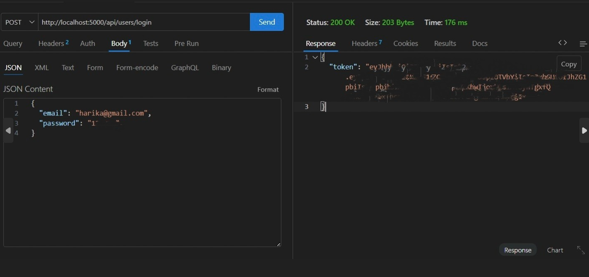
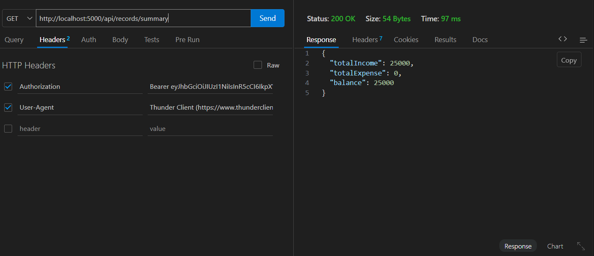
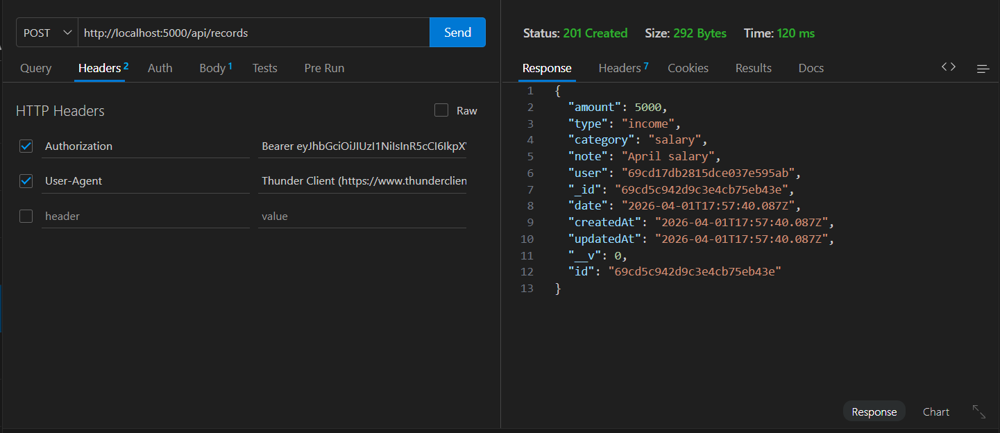
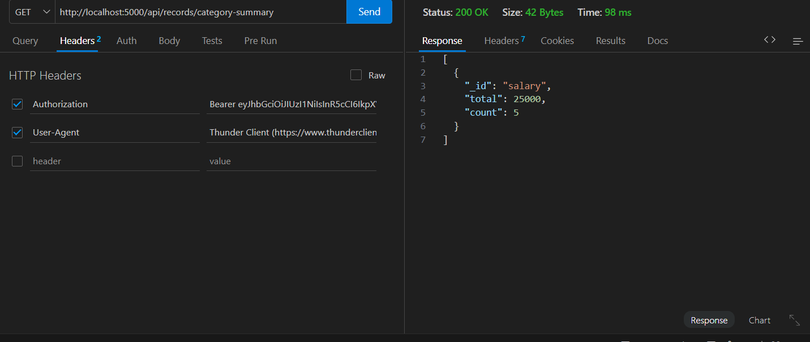
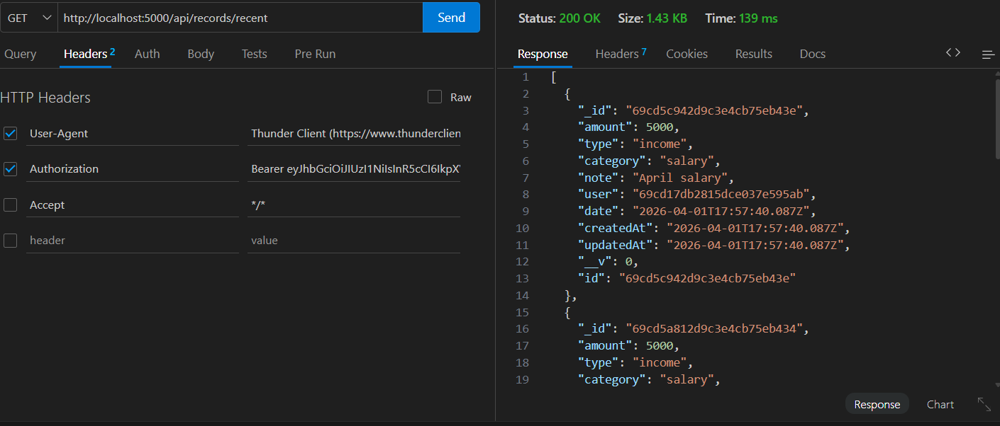

## Finance Data Processing and Access Control Backend

---

## Objective

This project is developed as part of a Backend Developer Internship assignment. The main objective is to design and implement a secure, scalable backend system for financial data management with authentication, authorization, and analytics.

---

## Overview

This backend system is a **Finance Management API** where users can manage income and expense records based on their roles.

It provides:
- Secure authentication using JWT
- Role-Based Access Control (RBAC)
- Financial record tracking
- Advanced analytics dashboard
- RESTful API architecture

---

## Project Screenshots

### Login API

---

### Summary API

---

### Records API

---

###  Category Summary API

---

### Recent Records API

---

## Tech Stack

- Node.js
- Express.js
- MongoDB
- Mongoose
- JWT Authentication
- Express Validator
- REST API Architecture

---

## System Architecture

The project follows **MVC Architecture**:

- **Models** → Database schema design using Mongoose
- **Controllers** → Business logic implementation
- **Routes** → API endpoints definition
- **Middleware** → Authentication & Role verification
- **Utils** → Helper functions and reusable logic

---

## Authentication Implementation

### Flow:
1. User registers with name, email, password
2. Password is hashed using bcrypt
3. On login, JWT token is generated
4. Token is required for all protected routes
5. Middleware verifies token before access

### Key Features:
- Secure password storage
- Token-based authentication
- Protected route handling
- Session-less backend design

---

##  Role-Based Access Control (RBAC)

### Roles:

- **Viewer**
  - Can only view data

- **Analyst**
  - Can view + analytics access

- **Admin**
  - Full access (Create, Update, Delete, Manage users)

### Security Rule:
Every API checks:
- Token validity
- User role permission

---

## Financial Record System

### Features:

- Add income and expense records
- Update financial entries
- Delete records (Admin only)
- View paginated records
- Filter by category and type
- Each record belongs to a user

### Business Logic:

- Income increases balance
- Expense decreases balance
- User isolation ensures data privacy

---

## Analytics System

Implemented using **MongoDB Aggregation Pipeline**

### Features:

- Total Income calculation
- Total Expense calculation
- Net Balance computation
- Category-wise grouping
- Recent transactions API
- Dashboard summary API

---

## API Endpoints

**Authentication APIs**

- POST /api/users/register
- POST /api/users/login

**User APIs**

- GET /api/users/me
- PATCH /api/users/:id/role
- PATCH /api/users/:id/status
- PATCH /api/users/me

**Record APIs**

- GET /api/records
- POST /api/records
- PUT /api/records/:id
- DELETE /api/records/:id

**Analytics APIs**

- GET /api/records/summary
- GET /api/records/category-summary
- GET /api/records/recent
- GET /api/records/dashboard

---

## Sample API Responses

**Login Response**
json
{
  "token": "JWT_TOKEN",
  "user": {
    "id": "123",
    "name": "harika",
    "email": "harika@example.com",
    "role": "admin"
  }
}

**Summary Response**
{
  "totalIncome": 20000,
  "totalExpense": 5000,
  "balance": 15000
}

**Category Summary Response**
[
  {
    "_id": "salary",
    "total": 20000,
    "count": 4
  }
]

---

## Validation Rules
1. Amount must be numeric and greater than 0
2. Type must be income or expense
3. Category is required
4. Invalid input returns validation errors

---

## Security Features
- JWT Authentication
- Role-Based Access Control
- Input Validation using express-validator
- Data Isolation per user
- Protected API Routes

---

### Database Design
**User Schema**
- name
- email
- password (hashed)
- role (viewer / analyst / admin)
- status (active / inactive)

**Record Schema**
- amount
- type
- category
- date
- note
- user (reference)

---

### Implementation Details (Important)
**Backend Design**
- Built using Express.js framework
- RESTful API design principles followed
- Modular folder structure for scalability

**Security Implementation**
- Password hashing using bcrypt
- JWT token-based authentication
- Middleware-based route protection

**Data Handling**
- MongoDB used for flexible schema design
- Aggregation pipeline for analytics
- Pagination implemented for performance

**Performance Optimization**
- Indexed MongoDB fields (user, date)
- Reduced query load using filtering
- Efficient aggregation for dashboard

**Code Quality**
- Clean MVC architecture
- Reusable middleware functions
- Error handling centralized

---

### Project Structure
src/
├── controllers/
├── models/
├── routes/
├── middleware/
├── utils/
server.js

**Setup Instructions**
1. Clone Repository
git clone https://github.com/harikaragiri/finance-backend
2. Install Dependencies
npm install
3. Create .env file
PORT=5000
MONGO_URI=your_mongodb_uri
JWT_SECRET=your_secret_key
4. Run Server
npm start

---

### Assumptions
- Each financial record belongs to one user
- Admin has full system access
- JWT required for all protected routes
- Default pagination limit is 10 records

---

### Conclusion

This project demonstrates a production-level backend system with secure authentication, role-based authorization, and analytics capabilities.

- It follows industry-standard backend practices including:
1. Modular architecture
2. Secure API design
3. Efficient database queries
4. Scalable structure