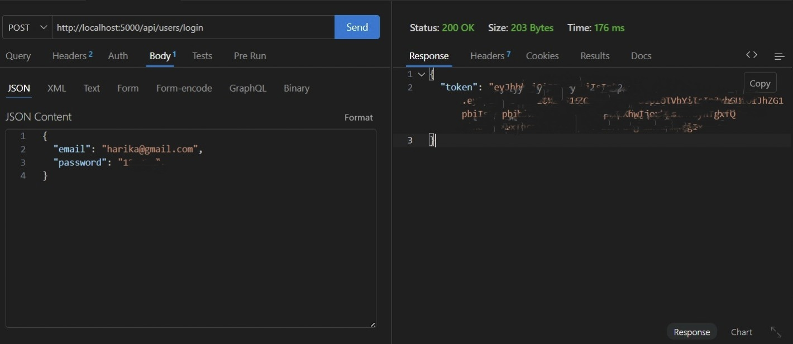

# Finance Data Processing and Access Control Backend

## Objective

This project is developed as part of a Backend Developer Internship assignment. The goal is to demonstrate backend development skills such as API design, data modeling, business logic, and role-based access control.

---

## Overview

This backend system represents a finance dashboard where users can manage financial records based on their roles.

The system focuses on secure authentication, role-based permissions, proper handling of financial data, and providing summary analytics for a dashboard.

---

## Tech Stack

- Node.js  
- Express.js  
- MongoDB  
- Mongoose  
- JWT Authentication  
- Thunder Client (for API testing)

---

## Implementation

The project is structured using a modular backend architecture to ensure clarity and maintainability.

- **Controllers** handle request and response logic  
- **Models** define database schemas using Mongoose  
- **Routes** define API endpoints and connect them to controllers  
- **Middleware** is used for authentication and role-based access control  
- **Utils** contains reusable helper functions like async error handling  

### Authentication

- JWT (JSON Web Token) is used for secure authentication  
- On login, a token is generated and sent to the client  
- Protected routes require the token in the Authorization header  

### Role-Based Access Control

- Roles include Viewer, Analyst, and Admin  
- Middleware checks user role before allowing access  
- Different endpoints are restricted based on roles  

### Data Handling

- Each financial record is linked to a specific user  
- MongoDB aggregation is used for calculating summary data  
- Filtering and pagination are implemented for better performance  

---

## Roles and Permissions

- Viewer: Can only view records  
- Analyst: Can view records and access analytics  
- Admin: Can create, update, delete records and manage users  

---

## Access Control

- Only Admin can create, update, or delete records  
- Analyst and Admin can access analytics APIs  
- Viewer has read-only access  

Access control is implemented using JWT authentication and role-based middleware.

---

## Features

### User Management

- User registration  
- User login with JWT  
- Role assignment  
- Active and inactive user status  

### Financial Records

- Create records  
- View records  
- Update records  
- Delete records  
- Filter by type, category, and date  

### Dashboard APIs

- Total income  
- Total expenses  
- Net balance  
- Category-wise summary  
- Recent transactions  

---

## API Endpoints

### Auth APIs

POST /api/users/register  
POST /api/users/login  

### User API

GET /api/users/me  

### Records APIs

GET /api/records  
POST /api/records  
PUT /api/records/:id  
DELETE /api/records/:id  

### Analytics APIs

GET /api/records/summary  
GET /api/records/category-summary  
GET /api/records/recent  

---

## Sample API Responses

### Login

```json
{
  "token": "JWT_TOKEN_HERE"
}
```

### Summary

```json
{
  "totalIncome": 20000,
  "totalExpense": 0,
  "balance": 20000
}
```

### Category Summary

```json
[
  {
    "_id": "salary",
    "total": 20000,
    "count": 4
  }
]
```

---

## Validation Example

If a user already exists:

```json
{
  "message": "Email already exists"
}
```

---

## API Screenshots

### Login API  


### Summary API  


### Category Summary API  


### Records API  


### Recent Records API  


---

## Setup Instructions

1. Clone the repository  
   git clone https://github.com/harikaragiri/finance-backend.git  

2. Install dependencies  
   npm install  

3. Create a `.env` file and add:  
   PORT=5000  
   MONGO_URI=your_mongodb_uri  
   JWT_SECRET=your_secret  

4. Run the server  
   npm run dev  

---

## Assumptions

- Each record belongs to one user  
- Only Admin can modify records  
- JWT is used for authentication  
- Pagination limit is set to 10  

---

## Enhancements

- Pagination  
- Filtering  
- MongoDB aggregation  
- Indexed fields for better performance  
- Clean and structured project design  

---

## Project Structure

src/  
controllers/  
models/  
routes/  
middleware/  
utils/  

---

## Author

Harika Ragiri  

---

## Conclusion

This project demonstrates backend design, role-based access control, authentication, and data handling. The focus is on building a clean and maintainable backend system that follows real-world practices.